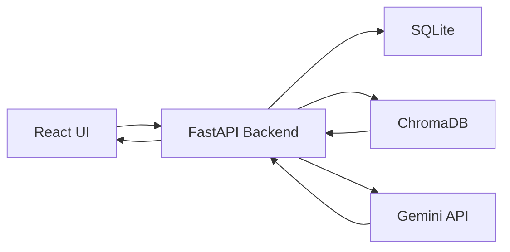

# CareerFit AI

> 취업·공모전 데이터 기반 맞춤형 AI 포트폴리오 코치

## 프로젝트 개요

대학생들은 취업, 인턴, 공모전, 대외활동을 준비할 때 어떤 경험과 역량을 쌓아야 하는지 판단하기 어렵다.

공고마다 요구하는 기술 스택, 우대사항, 활동 경험이 다르기 때문에 사용자가 직접 여러 공고를 비교하고 분석해야 한다.

CareerFit AI는 사용자의 전공, 보유 스킬, 관심 직무를 바탕으로 취업·공모전 데이터를 검색하고, 사용자의 현재 역량과 목표 직무 사이의 차이를 분석해 맞춤형 포트폴리오 방향을 제안하는 서비스이다.

RAG 구조를 활용하여 관련 공고 데이터를 먼저 검색하고, 검색된 공고를 근거로 Gemini 모델이 맞춤형 분석 결과를 생성한다.

---

## 기술 스택

| 영역 | 기술 |
|---|---|
| 백엔드 | Python 3.11, FastAPI |
| AI API | Gemini 2.5 Flash-Lite |
| 데이터 | Pandas, SQLite, ChromaDB |
| 프론트엔드 | React, Vite, Tailwind CSS |
| 실행 환경 | Docker |
| 배포 | Render |

---

## 아키텍처



### 처리 흐름

```text
사용자 입력
→ React UI
→ FastAPI /analyze API
→ ChromaDB에서 관련 공고 검색
→ 검색 결과를 Gemini에 context로 전달
→ AI 분석 결과 생성
→ answer와 sources를 프론트엔드에 반환
```

---

## 실행 방법

### 1. Docker로 백엔드 실행

프로젝트 루트에서 실행한다.

```bash
docker build -t careerfit-ai ./backend
docker run -p 8000:8000 --env-file backend/.env careerfit-ai
```

API 문서:

```text
http://localhost:8000/docs
```

Health Check:

```text
http://localhost:8000/health
```

---

### 2. 백엔드 로컬 실행

```bash
cd backend
python -m uvicorn main:app --reload --port 8000
```

---

### 3. 프론트엔드 로컬 실행

```bash
cd frontend
npm install
npm run dev
```

프론트엔드 주소:

```text
http://localhost:5173
```

---

## 환경변수

`backend/.env` 파일에 아래 값을 설정한다.

```env
GEMINI_API_KEY=your_gemini_api_key_here
MOCK_MODE=false
LLM_MODEL=gemini-2.5-flash-lite
```

실제 `.env` 파일은 GitHub에 올리지 않는다.

`.env.example`에는 실제 API Key가 아닌 예시 값만 작성한다.

---

## 데이터 파이프라인

CareerFit AI는 취업·공모전 데이터를 CSV로 관리하고, 전처리 과정을 거쳐 SQLite와 RAG용 JSON 파일로 저장한다.

```text
CSV
→ Pandas 전처리
→ SQLite 저장
→ RAG 문서 생성
→ ChromaDB 벡터 검색
→ Gemini 답변 생성
```

전처리 실행:

```bash
cd backend
python data/preprocess.py
```

### SQLite와 ChromaDB를 함께 사용하는 이유

SQLite는 회사명, 직무명, 요구 스킬 같은 정형 데이터를 구조화해서 저장하기 위해 사용한다.

ChromaDB는 사용자의 질문과 채용공고 내용을 의미 기반으로 검색하기 위해 사용한다.

즉, SQLite는 데이터 관리용이고, ChromaDB는 RAG 검색용이다.

---

## 주요 기능

- 사용자의 전공, 보유 스킬, 관심 직무 입력
- 채용공고 데이터 기반 RAG 검색
- Gemini 기반 맞춤형 역량 분석
- 참고한 공고 출처를 `sources`로 함께 반환
- API 한도 초과 대비 Mock Mode 지원
- React 기반 입력 화면과 결과 카드 제공
- Docker 기반 백엔드 실행 지원
- `/health` 엔드포인트를 통한 서버 상태 확인

---

## API 예시

### GET `/health`

서버 상태를 확인한다.

응답 예시:

```json
{
  "status": "ok"
}
```

---

### GET `/jobs`

저장된 공고 목록을 조회한다.

---

### POST `/analyze`

사용자의 전공, 보유 스킬, 관심 직무를 바탕으로 역량 분석을 요청한다.

요청 예시:

```json
{
  "major": "전자전기컴퓨터공학부",
  "skills": ["Python", "SQL", "반도체소자", "전자회로"],
  "job_type": "반도체 공정 엔지니어"
}
```

응답 예시:

```json
{
  "answer": "AI 분석 결과가 반환됩니다.",
  "sources": [
    {
      "company": "삼성전자",
      "title": "반도체 공정 엔지니어"
    }
  ]
}
```

---

## 진행 현황

- [x] 1일차: 프로젝트 기획 및 개발 환경 세팅
- [x] 2일차: FastAPI 서버 기본 구조 구현
- [x] 3일차: 데이터 파이프라인 구축
- [x] 4일차: RAG 기반 서비스 및 React UI 구현
- [x] 5일차: Docker 실행 환경 구성 및 포트폴리오 문서 정리

---

## 검증 결과

- [x] FastAPI `/health` 정상 응답 확인
- [x] FastAPI `/docs` Swagger UI 접속 확인
- [x] `/jobs` API 응답 확인
- [x] `/analyze` API에서 `answer`와 `sources` 반환 확인
- [x] React UI에서 입력폼 출력 확인
- [x] React UI에서 결과 카드 출력 확인
- [x] React UI에서 출처 카드 출력 확인
- [x] Docker 이미지 빌드 성공
- [x] Docker 컨테이너 실행 후 `/health` 접속 확인
- [x] `.env` 파일 GitHub 미포함 확인

---

## 프로젝트 구조

```text
carreerfit_ai/
├─ backend/
│  ├─ routers/
│  ├─ services/
│  ├─ data/
│  ├─ main.py
│  ├─ requirements.txt
│  ├─ Dockerfile
│  └─ .dockerignore
├─ frontend/
│  ├─ src/
│  │  └─ components/
│  ├─ package.json
│  └─ tailwind.config.js
├─ docs/
│  ├─ CHECKLIST.md
│  ├─ EVAL_QUESTIONS.md
│  └─ MODEL_BENCHMARK.md
├─ harness/
├─ .cursor/
│  └─ rules/
├─ .env.example
├─ .gitignore
└─ README.md
```

---

## 보안 규칙

- 실제 API Key는 `.env` 파일에만 저장한다.
- `.env` 파일은 GitHub에 올리지 않는다.
- GitHub에는 `.env.example`만 업로드한다.
- React 코드에 API Key를 직접 넣지 않는다.
- Docker 실행 시에는 `--env-file backend/.env` 방식으로 환경변수를 주입한다.

GitHub에 올리면 안 되는 파일:

```text
.env
backend/.env
venv/
backend/venv/
node_modules/
frontend/node_modules/
backend/chroma_db/
backend/data/chroma_db/
```

---

## 향후 개선

- 이력서 PDF 자동 분석
- 공모전 마감일 캘린더 연동
- 사용자별 포트폴리오 추천 기록 저장
- 실제 채용 공고 자동 수집
- 직무별 부족 역량 시각화
- RAG 검색 품질 평가 지표 추가
- 프론트엔드 외부 배포

---

## 개발 과정

이번 프로젝트에서 가장 어려웠던 부분은 RAG 검색 결과와 Gemini 답변을 연결하는 과정이었다.

처음에는 사용자의 입력만 LLM에 전달했지만, 이후 사용자의 전공, 스킬, 관심 직무를 하나의 query로 만들고 ChromaDB에서 관련 공고를 검색하도록 수정했다.

검색된 공고 내용을 context로 Gemini에 전달하고, 응답에는 `answer`와 `sources`를 함께 반환하도록 구성하여 공고 데이터에 근거한 분석 결과를 만들 수 있었다.

또한 Docker를 사용해 FastAPI 백엔드를 컨테이너로 실행하면서 로컬 환경과 배포 환경의 차이를 줄일 수 있었다.

---

## Demo

- Backend API: Render 배포 주소 입력
- Local Frontend: `http://localhost:5173`

---

## Developer

- Name: 조규리
- Role: Backend / AI Service Development
- Project: CareerFit AI